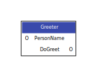
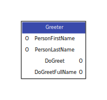
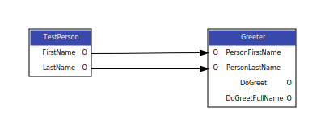
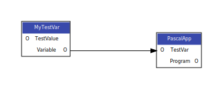

## About nodes

A maki node is defined in a .maki file through the maki language. It consists of inputs and outputs. These can be connected to each other, but you can only connect outputs to inputs so the graph goes only in one direction. An input only accepts one output however it is possible to connect an output to multiple inputs.

## Defining nodes

The most simple node goes like this.

    ---
    node NameOfTheNode
    ---

It is however completely useless because it does not output anything and you cannot connect anything to it. To change this you need to define an output.

## Outputs

    ---
    node HelloWorld
    ---

    output text ShowHelloWorld

    'Hello World!'

| keyword |type |name          |
|---------|-----|--------------|
| output  |text |ShowHelloWorld|

An output is a special socket that contains fragments. If you trigger the output of ShowHelloWorld you get the text from the string. A string in Maki is called chunk and needs to be quoted in the same way as a pascal string. It is the most simple fragment. In the basic node you need to select which output you want to have. If you define more outputs it is possible to get multiple text buffers from the same node setup which can be saved to separate files. In this node the text is hardcoded and so the output will always stay the same.

## Inputs and select

    ---
    node Greeter
    input text PersonName
    ---

    output text DoGreet

    'Hello ' select PersonName '! How are you?'

| keyword |type |name       |[= optional default value]|
|---------|-----|-----------|--------------------------|
| input   |text |PersonName | = 'Hans Wurst'           |

| keyword | name of input |[:optional defines]|
|---------|---------------|-------------------|
| select  | PersonName    |:explained_later   |

Another type of fragment is the the selector. We can define the input PersonName where that we can assign a value to. The name is then inserted into the output if we use select followed by the input's name. There is no special concatenation operator and you can simply attach multiple chunks and commands together. If we wanted, we could initialize the node with some default value.

    input text PersonName = 'Hans Wurst'

---
**NOTE**

Inputs beginning with two underscores are invisible in the designer. This is useful for nodes that are not supposed to be seen by the user like e.g. the outputs of the root node that should not be connected to something else.
---

## Multiple outputs

To better illustrate the concept of multiple outputs we extend the Greeter example.

    ---
    node Greeter
    input text PersonFirstName = 'Hans'
    input text PersonLastName = 'Wurst'
    ---

    output text DoGreet

    'Hello ' select PersonFirstName '! How are you?'

    output text DoGreetFullName

    'Hello ' select PersonFirstName ' ' select PersonLastName '! How are you?'

**Output of DoGreet**

    Hello Hans! How are you?

**Output of DoGreetFullName**

    Hello Hans Wurst!

We can now choose if we want the full name or only the first name. Another example would be a project template. We can define a project name and it is inserted in all locations where we use the select statement.

---
**NOTE**

Also note that a chunk can spread over multiple lines as you can see in the example below. If the beginning quote is indented and not preceeded by any other characters except spaces Maki will assume the rest of the chunk to be indented by the same amount and thus remove the extra spaces in front of each line.

---
    ---
    node TemplatePas
    input text ProjectName = 'Project1'
    ---

    output text lpr
    'program ' select ProjectName ';
      begin
      end.
    '

    #only a stub, not the complete lpi to not bloat the listing
    output text lpi

    '<?xml version="1.0" encoding="UTF-8"?>
    <CONFIG>
      <ProjectOptions>
        <Version Value="12"/>
        <General>
          <Flags>
            <UseDesignTimePackages Value="True"/>
          </Flags>
          <SessionStorage Value="InProjectDir"/>
          <Title Value="' select ProjectName'"/>
        </General>
      </ProjectOptions>
    </CONFIG>'

## Connecting multiple nodes

For now we have only used one node. However it also possible to connect other nodes to your inputs. If we add the below node to our Greeter example, we can connect FirstName to PersonFirstName and LastName to PersonLastName.

    ---
    node TestPerson
    ---

    output text FirstName

    'Peter'

    output text LastName

    'Lustig'

We then get this output.

### Output of DoGreet

    Hello Peter! How are you?

### Output of DoGreetFullName

    Hello Peter Lustig!

## Defines

Sometimes you need to add text to different locations in the original text. One situation would be if you define a pascal var in a program. You would have to add it to the var section and assign a value between begin and end. You can do so using defines. In your node that is connected to another node you can check for a define using ifdef. However there is no special define statement. A define is always tied to a select statement and is only valid for this single statement and all nested elements. That means if an input is connected to an output and itself has inputs with connected outputs then the define is also implicitly valid for a select statement in the second node's output.

    ---
    node MyTestVar
    input text TestValue = 'ABC'
    ---

    output text Variable
    ifdef ( varsection )
    '  MyTestVar: String;'
    endif

    ifdef ( assignment )
    '  MyTestVar:= ''' select TestValue ''';
    '
    endif

    ---
    node PascalApp
    input text TestVar
    ---

    output text Program
    'program PascalApp;
    var
    'select TestVar:varsection'

    begin
    'select TestVar:assignment'
    end.
    '

**Output of Program**

    program PascalApp;
    var
      MyTestVar: String;

    begin
      MyTestVar:= 'ABC';
    end.

Multiple defines can be comma-separated. This is true for both ifdef and select. There is also an **else** statement which comes before the endif. If you only need the else part you can also use **ifndef**.

If you want you can try to adapt the Greeter node from the previous example to use only a Name input by using the defines FirstName and LastName.

## Check if outputs are connected

If we do not connect anything to PascalApp.TestVar this would result in an empty var section which is illegal in Pascal syntax. We can check if something is connected using **ifconn**. The syntax is the same as ifdef but instead of a define we use an input as the parameter. Unlike ifdef you can not use multiple parameters with ifconn. There is also **else** and **ifnconn**.

    ---
    node PascalApp
    input text TestVar
    ---

    output text Program
    'program PascalApp;
    '
    ifconn( TestVar )
    'var
    '
    select TestVar:varsection
    endif

    '
    begin
    'select TestVar:assignment'
    end.
    '

## Builtin types and type nodes

As you may have noticed there is always a *text* identifier in front of every input and output. This is because there are different types to choose from. First there are builtin types.

### Simple types
| type identifier | Pascal representation | example input                 |
|-----------------|-----------------------|-------------------------------|
| text            | String                | input text TextInput = 'text' |
| int             | Integer               | input int IntInput = 1        |
| float           | Single                | input float FloatInput = 1.0  |
| bool            | Boolean               | input bool BoolInput = true   |

### Special types
| type identifier | Pascal representation | example input                 |
|-----------------|-----------------------|-------------------------------|
| type [ length ] | array                 | input float [4] Vec4 = [ 1.0, 1.0, 1.0, 1.0 ]

In the end everything is converted to string but in the design mode you have different widgets for manipulating a node's values. And you can define how types are converted to another type. For that you have to define a type node.
For every use case of Maki you will probably have to define a different set of type nodes.

### How to define a type node

A type node is like a normal node without the possibility to define any inputs but with an implicit **data** input. Let's define an example type node for float for working with Pascal code to explain how this works.

    # the first float is the internal type this is mapped to, the second float is the name of the type
    ---
    type float float
    ---

    # a constructor is used for every value that does not have a connected output
    # This defines how the data for eg. 1.0 is converted to text

    output text constructor
    select data

    output text int
    'round( ' select data ' )'

    output text text
    'FloatToStr( ' select data ' )'

A type node begins with the type section followed by an internal type. After this comes the name of the type. We can either define a node for an internal type or we can choose to define a new type that however has to be based on an internal type.

We cannot define any inputs so there is always only one line in the header.

The outputs name is either **constructor**. This is used whenever data of that type is inserted into the output. E.g. if an float input has a value of 1.0 that value is inserted into the output by calling the constructor. If we had C code it would be possible here to add the trailing *f* (1.0f).

The other outputs should have the name of other types. These outputs are used when converting to those types. If we connect a float socket to an int socket a type conversion needs to be done in Pascal by using for example round. This is mainly for convenience to not have to create a round node which is also possible. For converting an int to float we need to define an int type node.

## Libraries

Libraries are another special node type. They behave more or less like normal nodes but are only added once into the output. If we insert code that requires the use of a type definition in the type section or defining a dependency to a module we can define a library for that type or dependency section. If this library is referenced by a node we simply add a lib statement into the node's header. Even if we use two instances of the same node or a completely different node with the same type section the library is only inserted once. Like type nodes libraries can not have inputs. To insert the content of a library you need to use the recursive selector in combination with all modifier.

    ---
    lib MySpecialType
    ---

    output text __Declaration

    ---
    node SomeOtherNode
    import MySpecialType
    ---

## Special select statements

### Overriding the output

It is possible to override the output for a selected node. With this you can select a different output of a connected node. This is useful in combination with the recursive selector.

### Recursive selector

The recursive selector is a special selector that selects all nodes connected to a socket, including child nodes. It is mandatory to override the output.

In the root node you can call the recursive selector to query all nodes that require a declaration. Please note that __Declaration is not a builtin name.
It will in fact look for nodes with the given output name and these are inserted. If none are found the result will be empty. This way you can control in which sections in your main outputs declarations, initializations and the like are inserted, without making the node setup too complicated.

    rselect Input1.__Declaration

### All modifier

If you have multiple inputs and you have a section where your declaration of all your inputs go to you may not want to do an rselect for every input separately. You can instead use the asterisk (\*) symbol to indicate that you are searching in every input. It has to be used in combination with the recursive selector. Additionaly it will also look for the output in all  **libraries** referenced by this node including child nodes. Though it may look like a [wild card](https://www.wikiwand.com/en/Wildcard_character) it is not allowed to mix it with an identifier.

    rselect *.__Declaration
